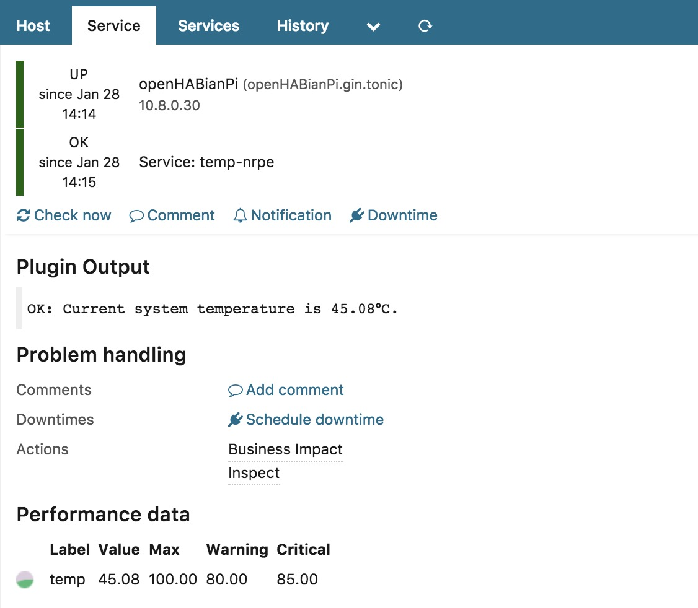
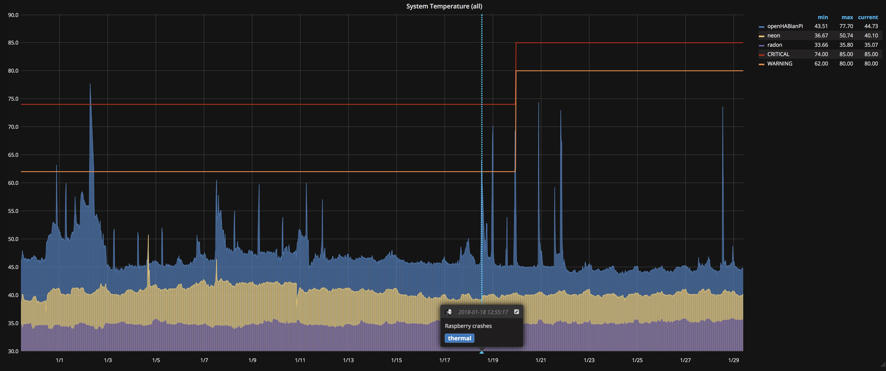

*This repository is archived.*

# icinga2-plugin-raspberrypi_temp
Check and report Raspberry Pi system temperature

* Small script I wrote for my Raspberry Pi farm
* Provides perfomance data (of course!)
* Tested on Raspberry 1, 2 and 3 (Raspbian)

### Usage
```
Usage: check_raspberrypi_temp [-w warning_value] [-c critical_value]
   -w: warning threshold, default 80°C when unset
   -c: critical threshold, default 85°C when unset
```

### Example
```
$ ./check_raspberrypi_temp
OK: Current system temperature is 45.08°C.
|temp=45.08;60;75;0;100
```

### Screenshots
Example check output in Icinga Web 2.


Example Grafana dashboard showing all my Raspberries.


